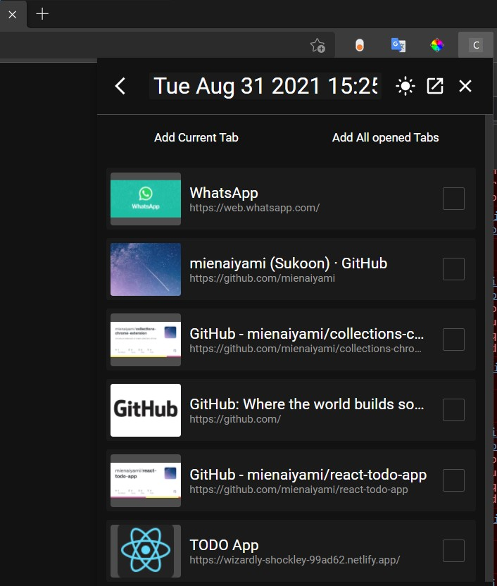
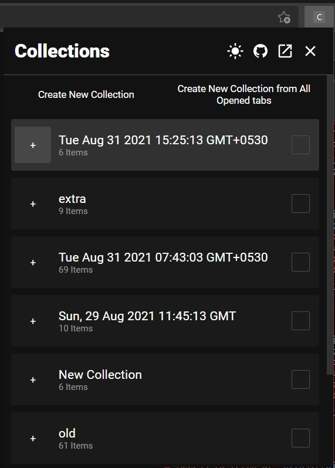
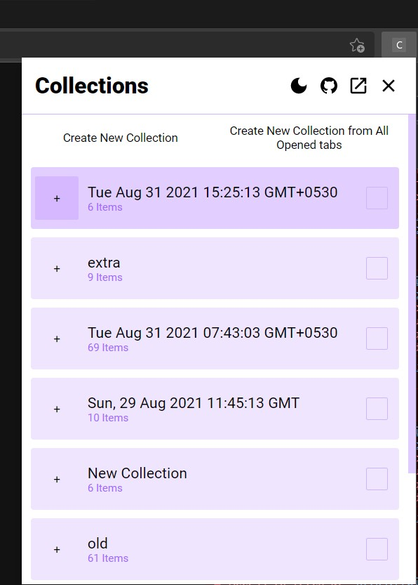
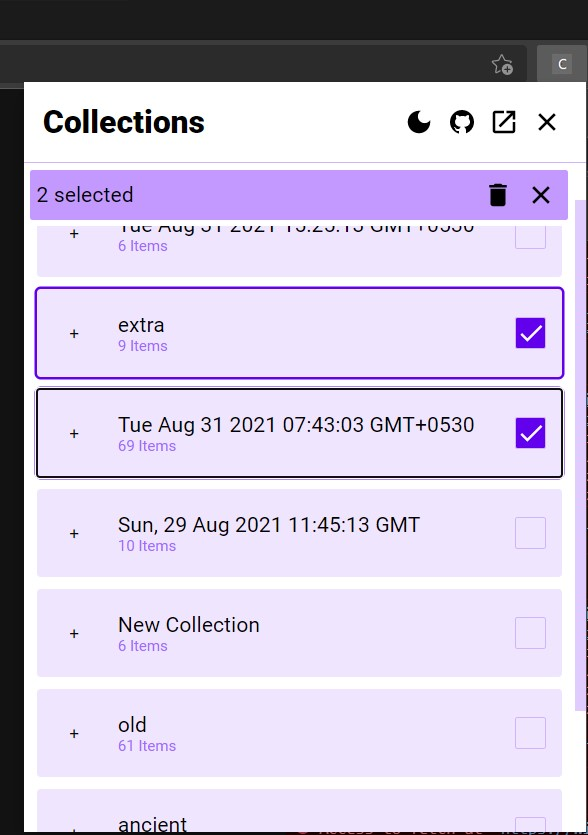
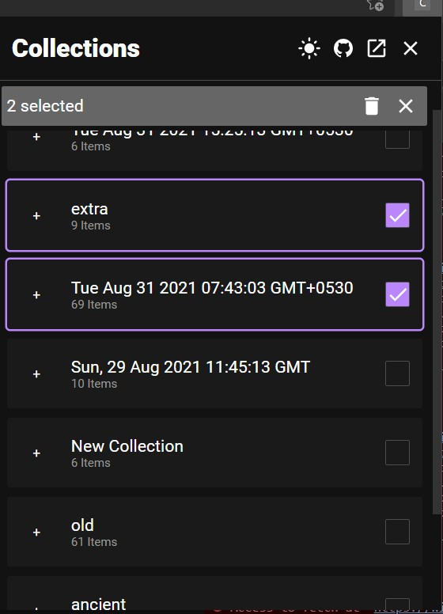
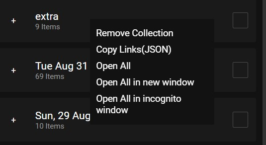
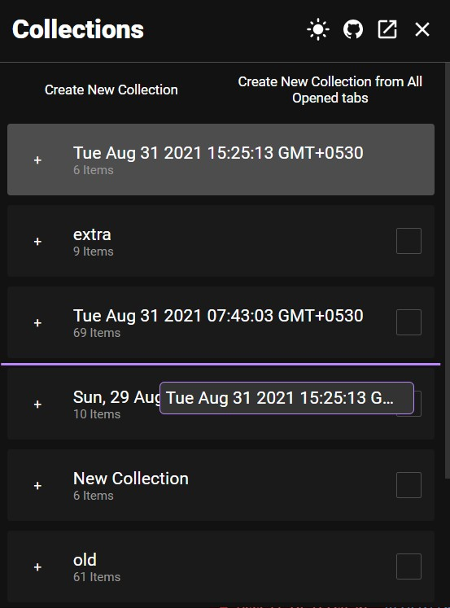

# ❗❗ Not recommended for use anymore

Use <https://github.com/mienaiyami/collection-extension-2.0>, if possible get it from store url for auto updates. 

# Collection extension for chromium based browser.

Unable to pusblish in store because it costs.

Try demo(most functions doest work)
[https://pensive-lumiere-f0d34a.netlify.app/](https://pensive-lumiere-f0d34a.netlify.app/)

If you want to try, download `/build` or `build.zip` from releases, open extension option in your browser, enable developer mode, load unpacked and select `/build`. You can turn off developer mode now.

---

## Demo Image

Drag to reorder

